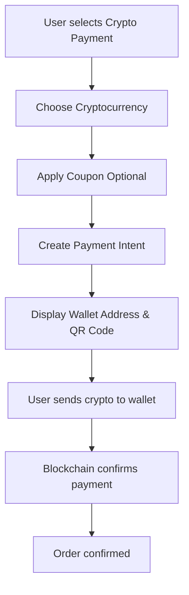

# 🪙 Direct Cryptocurrency Payment Integration

This document explains how to set up and use the direct cryptocurrency payment feature in SmartSupply Health.

## 🚀 Features

- **Direct Wallet Payments**: Receive payments directly to your wallet addresses
- **Multiple Cryptocurrencies**: Support for Bitcoin, Ethereum, and Solana
- **Real-time Status**: Live payment status updates
- **QR Code Generation**: Easy payment scanning
- **User-friendly Interface**: Simple wallet address display and copy functionality

## 🔧 Setup Instructions

### 1. Wallet Addresses

You need to provide your wallet addresses for each supported cryptocurrency:

- **Bitcoin Address**: Your Bitcoin wallet address (starts with 1, 3, or bc1)
- **Ethereum Address**: Your Ethereum wallet address (starts with 0x)
- **Solana Address**: Your Solana wallet address (base58 encoded)

### 2. Environment Configuration

Add these variables to your `backend/.env` file:

```env
# Direct Wallet Payment Configuration
BITCOIN_ADDRESS=your_bitcoin_wallet_address_here
ETHEREUM_ADDRESS=your_ethereum_wallet_address_here
SOLANA_ADDRESS=your_solana_wallet_address_here

# Optional: For blockchain monitoring (future feature)
BLOCKCHAIN_API_KEY=your_blockchain_api_key_here
```

### 3. Install Dependencies

The required dependencies are already installed:
```bash
npm install axios crypto
```

## 📱 How It Works

### For Users

1. **Select Payment Method**: Choose between "Credit/Debit Card" or "Cryptocurrency"
2. **Choose Crypto**: Select from supported cryptocurrencies (BTC, ETH, SOL)
3. **Apply Coupon** (Optional): Enter coupon code for discounts
4. **Create Payment**: Click "Create Crypto Payment"
5. **Complete Payment**: 
   - Copy the wallet address or scan QR code
   - Send the exact amount shown to the wallet address
   - Payment status updates automatically when confirmed

### For Developers

#### API Endpoints

- `POST /api/crypto-payments/create/:orderId` - Create direct wallet payment
- `GET /api/crypto-payments/status/:orderId` - Check payment status
- `POST /api/crypto-payments/webhook` - Handle payment webhooks
- `GET /api/crypto-payments/supported-currencies` - Get supported cryptocurrencies

#### Frontend Components

- `PaymentModal.jsx` - Main payment modal with method selection
- `CryptoPaymentModal.jsx` - Dedicated crypto payment interface
- `CryptoPaymentModal.css` - Styling for crypto payment UI

## 🔒 Security Features

- **Webhook Verification**: Verify payment status through Coinbase Commerce webhooks
- **Order Validation**: Ensure only authorized users can create payments
- **Status Polling**: Real-time payment status updates
- **Automatic Expiry**: Payments expire after 30 minutes

## 🎨 UI/UX Features

- **Payment Method Selection**: Clean interface to choose between card and crypto
- **Crypto Selection**: Visual selection of supported cryptocurrencies
- **Real-time Updates**: Live payment status with visual indicators
- **Responsive Design**: Works on desktop and mobile devices
- **Error Handling**: Clear error messages and retry options

## 🧪 Testing

### Test Mode

Coinbase Commerce provides test mode for development:
- Use test API keys
- Test with fake cryptocurrencies
- No real money transactions

### Test Flow

1. Create an order
2. Select "Cryptocurrency" payment method
3. Choose a test cryptocurrency
4. Complete the test payment flow
5. Verify order status updates

## 📊 Supported Cryptocurrencies

- **Bitcoin (BTC)** - ₿
- **Ethereum (ETH)** - Ξ
- **Solana (SOL)** - ◎

## 🔄 Payment Flow



## 🚨 Troubleshooting

### Common Issues

1. **API Key Not Working**
   - Verify the API key is correct
   - Check if the key has proper permissions
   - Ensure you're using the right environment (test/live)

2. **Webhook Not Working**
   - Verify webhook URL is accessible
   - Check webhook secret configuration
   - Ensure HTTPS is enabled for production

3. **Payment Status Not Updating**
   - Check webhook endpoint is working
   - Verify order ID matching
   - Check database connection

### Debug Steps

1. Check backend logs for errors
2. Verify environment variables
3. Test API endpoints manually
4. Check your wallet for incoming transactions

## 📈 Future Enhancements

- **More Cryptocurrencies**: Add support for additional coins
- **Crypto Wallet Integration**: Direct wallet connections
- **Price Alerts**: Notify users of price changes
- **Multi-currency Support**: Support for different fiat currencies
- **Advanced Analytics**: Payment analytics and reporting

## 📞 Support

For technical support or questions about crypto payments:
- Check your wallet addresses are correct
- Verify the cryptocurrency amounts are accurate
- Review the API logs for error details
- Contact the development team

---

**Note**: This feature requires your wallet addresses to be configured. Make sure to use the correct addresses for each cryptocurrency. Test thoroughly in development before deploying to production.
